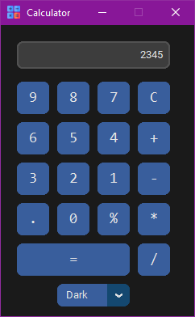
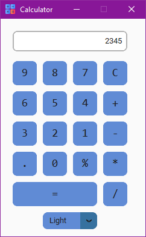

# Calculator
A simple theme based calculator.

## Running the Program
First install the customtkinter module:
```
pip install customtkinter
```
Executing the program:
```
python calculcator.py
```

<div>
<p float="left">
  
   
</p>
</div>